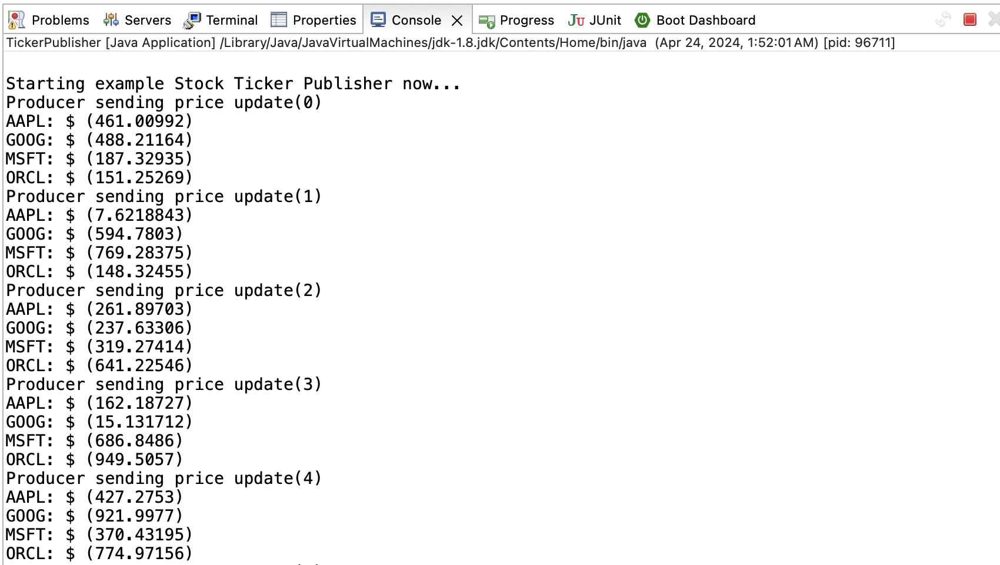
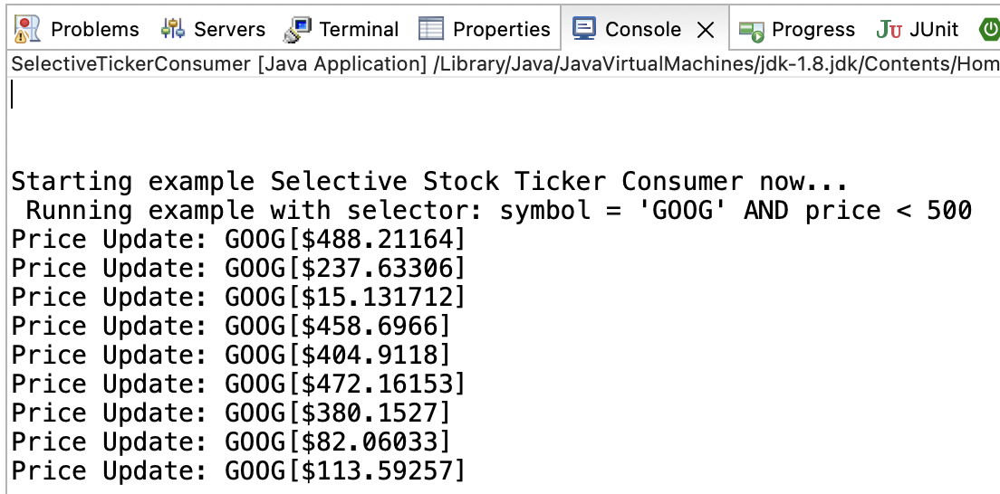
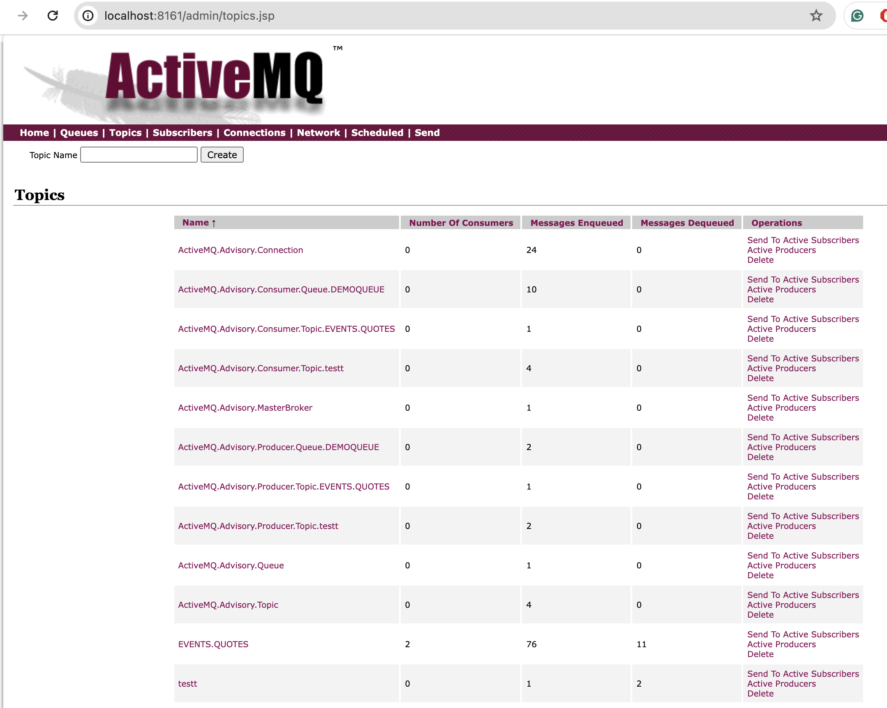

# stock-price-ticker-JMS-app

In this application, we implemented a stock price update service **event-publisher** and a consumer of these event **event-subscriber**, using JMS topics as event channels. In **selective-event-consumer**, it modifies the previous stock price consumer, and uses JMS selectors to filter the events it receives from the update service.

To allow consumers to go offline and, when they come back online, receive any messages that were sent while they were offline, we created a durable subscriber instead of a general consumer with `session.createDurableSubscriber()` instead of `createConsumer()`.

While using durable subscriptions, there are several limitations:
- Each JMS connection that is used to create a durable subscription must be assigned a unique client ID in order for the provider to identify the client each time its durable subscription is activated. Additionally the subscription needs its own ID value as well.
- The client must create the durable subscription at least once before the JMS provider will begin storing messages for that subscription.
- Only one JMS connection can be active at any given time for the same client ID and subscription ID meaning no load balancing is possible for multiple consumers on the same logical subscription.


## Sample JMS selectors:
```
//selector = System.getProperty("QuoteSel", "symbol = 'GOOG'");
//selector = System.getProperty("QuoteSel", "symbol IN ('GOOG','AAPL')");
selector = System.getProperty("QuoteSel", "symbol = 'GOOG' AND price < 500");
```

## DEMO:
1. Run TickerPublisher.java, we can see that the producer is sending stock prices.


2. Run SelectiveTickerConsumer.java, we can see that the consumer is receiving the stock price update events that our producer is firing with filtered conditions.


3. In the ActiveMQ Admin Console.



